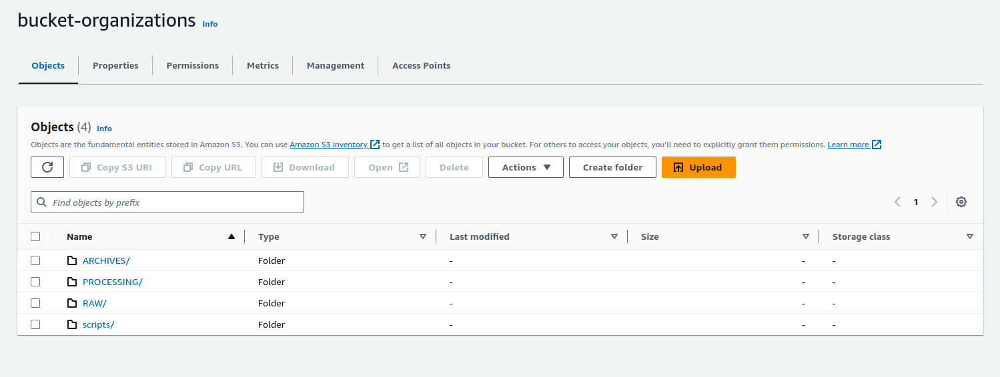
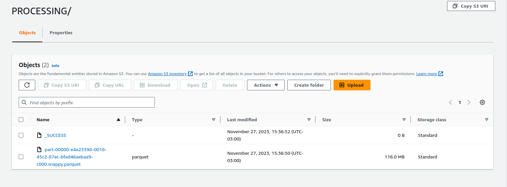
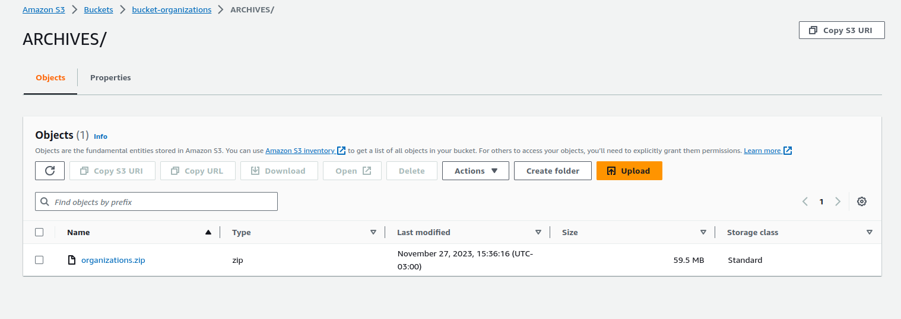
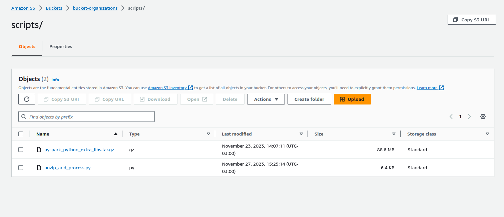
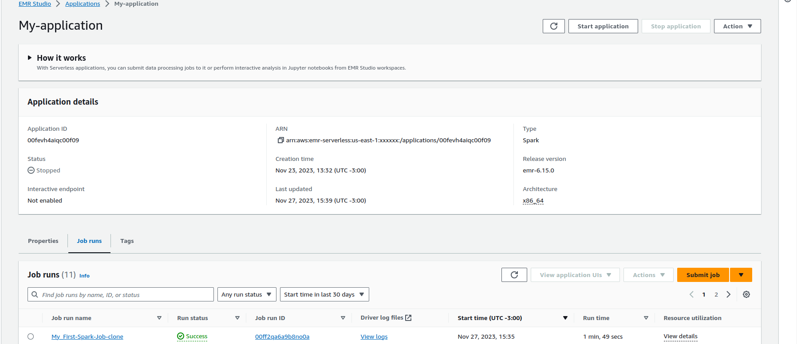
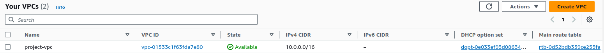
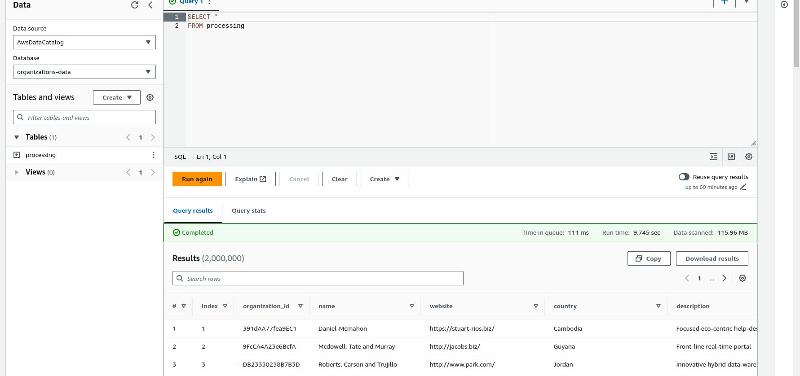
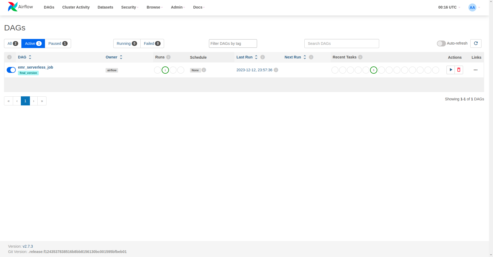
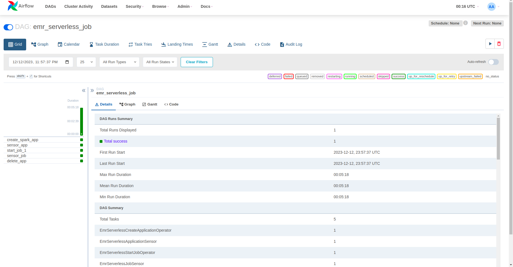
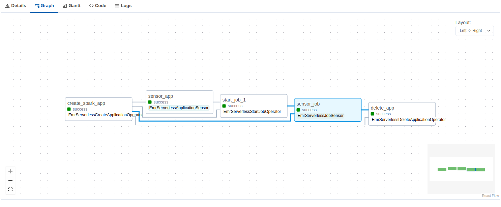

## Pipeline de Dados abertos sobre organizações(Empresas)

Olá!

Esse projeto de ETL na AWS, trata de ponta a ponta uma pipeline de dados abertos sobre organizações, relacionados aos nomes, país, quando foi fundado, etc.
Com o uso de Spark, Requests, Boto3, BytesIO e ZipFile!

Lista de ferramentas utilizadas:

## AWS Tools
- Athena
- EMR Serveless
- Glue Crawler
- Glue Database
- VPC
- S3
- IAM

## UNZIP_AND_PROCESS

#### [unzip_and_process.py](pyspark_scripts/unzip_and_process.py)

Vamos entender o que esta função python está fazendo. Essa função python está realizando uma requisição no link de onde baixamos nosso arquivo de organizações e enviando para o S3 dentro do nosso bucket.
Após o zip estar dentro do bucket, estamos extraindo o arquivo que existe dentro dele e salvamos no S3 novamente em uma pasta RAW.

Após isso vamos criar uma pasta chamada ARCHIVES e vamos copiar o nosso arquivo zip já extraido para esta pasta e excluir o zip da pasta antiga.

Posteriormente pegamos nosso arquivo csv da RAW, convertemos em parquet e mandamos para a pasta PROCESSING.

E por fim, estamos fazendo uma verificação para ver se o database no glue já é existente, se não, será criado o recurso. Após a criação do mesmo, é executada a criação do Crawler para que seja possível criar no Athena uma tabela para realizar consultas SQL dentro do Athena, seguindo a mesma lógica de criação do glue database.


```python
import requests
import boto3
#import os

from io import BytesIO
from pyspark.sql import SparkSession
from zipfile import ZipFile, BadZipFile

def upload_zip_to_s3(url, s3_bucket, s3_key):    
    response = requests.get(url)

    if response.status_code == 200:

        zip_bytes = BytesIO(response.content)

        s3_client = boto3.client('s3')

        try:
            s3_path = f"RAW/{s3_key}"

            s3_client.upload_fileobj(zip_bytes, s3_bucket, s3_path)

            print(f"Arquivo ZIP enviado com sucesso para o S3 em: s3a://{s3_bucket}/{s3_path}")
        except Exception as e:
            print(f"Erro ao enviar o arquivo para o S3: {e}")
        finally:
            s3_client.close()
    else:
        print(f"Erro ao baixar o arquivo. Código de status: {response.status_code}")

def processar_zip_no_s3(s3_bucket, zip_file_key):
    s3_client = boto3.client('s3')

    try:
        response = s3_client.get_object(Bucket=s3_bucket, Key=zip_file_key)
        zip_data = response['Body'].read()

        with ZipFile(BytesIO(zip_data)) as zip_ref:

            file_list = zip_ref.namelist()

            for file_name in file_list:
                with zip_ref.open(file_name) as file:
                    s3_target_key = f"RAW/{file_name}"
                    s3_client.put_object(Bucket=s3_bucket, Key=s3_target_key, Body=file.read())

        print("Deszipado com sucesso.")

    except BadZipFile as e:
        print(f"Erro ao deszipar: {str(e)}")
    except Exception as e:
        print(f"Erro inesperado: {str(e)}")

def creating_archive_folder(S3_BUCKET, zip_file_key, output_path):
    try:
        s3 = boto3.client('s3')

        s3.copy_object(Bucket=S3_BUCKET, CopySource={'Bucket': S3_BUCKET, 'Key': zip_file_key}, Key=output_path)

        s3.delete_object(Bucket=S3_BUCKET, Key=zip_file_key)

        print("Arquivo copiado com Sucesso")

    except Exception as e:
        print(f"Deu merda familia: {str(e)}")

def csv_to_parquet(input_csv_path, output_parquet_path):

    spark = SparkSession.builder.appName("Application").getOrCreate()

    ### CONFIG PARA TESTAR LOCAL

    #spark.sparkContext._jsc.hadoopConfiguration().set('spark.jars.packages', 'org.apache.hadoop:hadoop-aws:3.1.2,com.amazonaws:aws-java-sdk-bundle:1.11.271')
    #spark.sparkContext._jsc.hadoopConfiguration().set('spark.hadoop.fs.s3a.access.key', os.environ.get('AWS_ACCESS_KEY_ID'))
    #spark.sparkContext._jsc.hadoopConfiguration().set('spark.hadoop.fs.s3a.secret.key', os.environ.get('AWS_SECRET_ACCESS_KEY'))
    #spark.sparkContext._jsc.hadoopConfiguration().set("spark.hadoop.fs.s3a.impl", "org.apache.hadoop.fs.s3a.S3AFileSystem")
    #spark.sparkContext._jsc.hadoopConfiguration().set("spark.hadoop.fs.s3a.path.style.access", "true")
    #spark.sparkContext._jsc.hadoopConfiguration().set("spark.hadoop.fs.s3a.connection.ssl.enabled", "true")
    #spark.sparkContext._jsc.hadoopConfiguration().set("spark.hadoop.fs.s3a.connection.maximum", "200")
    
    try:
        df = spark.read.format("csv").option("header", "true").load(input_csv_path)
        df = df \
            .withColumnRenamed("Organization Id", "Organization_Id") \
            .withColumnRenamed("Number of employees", "Number_of_employees")
        
        df = df.repartition(1)

        df.write.parquet(output_parquet_path, mode="overwrite")

        print(f"CSV transformado em Parquet e salvo em: {output_parquet_path}")
    except Exception as e:
        print(f"Ocorreu um erro: {e}")

def create_glue_database(database_name, region_name):
    glue_client = boto3.client('glue', region_name=region_name)
    
    try:
        response = glue_client.create_database(
            DatabaseInput={'Name': database_name}
        )
        print(f'Banco de dados "{database_name}" criado com sucesso no AWS Glue Data Catalog.')
    except Exception:
        print(f'A database "{database_name}" já existe.')

def create_glue_crawler(crawler_name, database_name, s3_target, region_name):
    glue_client = boto3.client('glue', region_name=region_name)
    
    try:
        response = glue_client.create_crawler(
            Name=crawler_name,
            Role='arn:aws:iam::XXXXXXXX:role/glue-crawler-role', 
            DatabaseName=database_name,
            Targets={'S3Targets': [{'Path': s3_target}]}
        )
        print(f'Crawler "{crawler_name}" criado com sucesso no AWS Glue.')
    except glue_client.exceptions.AlreadyExistsException:
        print(f'O crawler "{crawler_name}" já existe.')
    except Exception as e:
        print(f'Erro ao criar o crawler: {str(e)}')


if __name__ == '__main__':

    S3_BUCKET = 'bucket-organizations'
    CRAWLER_NAME = 'organizations_crawler'
    S3_TARGET = 's3://bucket-organizations/PROCESSING/'
    DATABASE_NAME = 'organizations-data'
    REGION_NAME = 'us-east-1'

    url = "https://github.com/datablist/sample-csv-files/raw/main/files/organizations/organizations-2000000.zip"
    s3_key = "organizations.zip"

    upload_zip_to_s3(url, S3_BUCKET, s3_key)

    zip_file_key = "RAW/organizations.zip"

    processar_zip_no_s3(S3_BUCKET, zip_file_key)
    
    output_path = "ARCHIVES/organizations.zip"

    creating_archive_folder(S3_BUCKET, zip_file_key, output_path)

    csv_path = f"s3://{S3_BUCKET}/RAW/organizations-2000000.csv"
    parquet_output_path = f"s3://{S3_BUCKET}/PROCESSING/"

    csv_to_parquet(csv_path, parquet_output_path)

    create_glue_database(DATABASE_NAME, REGION_NAME)

    create_glue_crawler(CRAWLER_NAME, DATABASE_NAME, S3_TARGET, REGION_NAME)


# spark-submit --conf "spark.jars.packages=org.apache.hadoop:hadoop-aws:3.1.2,com.amazonaws:aws-java-sdk-bundle:1.11.271" unzip_and_process.py > t.log
```

## DOCKERFILE

#### [Dockerfile](pyspark_scripts/Dockerfile)

Este Dockerfile são instruções para criar uma imagem Docker personalizada, feita especificamente para facilitar o uso do PySpark e suas dependências. Inicialmente, escolhe o sistema operacional Amazon Linux, instala e configura uma versão específica do Python, criando um ambiente virtual. Posteriormente, instala bibliotecas Python, incluindo requests, boto3 e venv-pack, que é usado para empacotar todas as dependências e o ambiente virtual em um arquivo tar.gz. A imagem criada é otimizada para executar aplicações PySpark, fornecendo um ambiente pré-configurado, que simplifica a distribuição e execução do PySpark com as bibliotecas necessárias no arquivo tar.gz.


## AIRFLOW DAG

#### [t2.py](airflow/dags/t2.py)
#### [docker-compose](airflow/docker-compose.yaml)

Nesta DAG, utilizamos operadores do Emr Serverless para realizar 5 tasks. A primeira task envolve a criação da nossa aplicação no Emr Serverless. A segunda task é uma verificação que confirma se a aplicação foi criada com sucesso. Em caso afirmativo, a DAG avança para a terceira task, caso contrário, falha. A terceira task inicia a aplicação e executa nosso script PySpark armazenado no S3 com as dependências necessárias. A quarta task repete a verificação, desta vez garantindo a execução correta do script. Finalmente, a quinta task é responsável por excluir a aplicação.

```python
from datetime import datetime
from airflow import DAG
from airflow.providers.amazon.aws.operators.emr import EmrServerlessStartJobOperator
from airflow.providers.amazon.aws.operators.emr import EmrServerlessCreateApplicationOperator
from airflow.providers.amazon.aws.operators.emr import EmrServerlessDeleteApplicationOperator
from airflow.providers.amazon.aws.sensors.emr import EmrServerlessJobSensor
from airflow.providers.amazon.aws.sensors.emr import EmrServerlessApplicationSensor

JOB_ROLE_ARN = "arn:aws:iam::XXXXXXXXX:role/AmazonEMR-ExecutionRole-1700757232948"
S3_LOGS_BUCKET = "bucket-organizations"

DEFAULT_MONITORING_CONFIG = {
    "monitoringConfiguration": {
        "s3MonitoringConfiguration": {"logUri": f"s3://bucket-organizations/logs/"}
    },
}

networkConfiguration={
        'subnetIds': [
            'subnet-054da37447e4ac846',
            'subnet-0fdd57e4e5a85d87d',
        ],
        'securityGroupIds': [
            'sg-049d2081697556c8b',
        ]
    }

with DAG(
    dag_id="emr_serverless_job",
    schedule_interval=None,
    start_date=datetime(2023, 12, 7),
    tags=["final_version"],
    catchup=False,
) as dag:
    create_app = EmrServerlessCreateApplicationOperator(
        task_id="create_spark_app",
        job_type="SPARK",
        release_label="emr-6.15.0",
        aws_conn_id= 'aws_connect',
        config={"name": "airflow-test", "networkConfiguration": networkConfiguration},
    )

    create_app.wait_for_completion = True
    application_id = create_app.output

    sensor_app = EmrServerlessApplicationSensor(
        task_id="sensor_app",
        application_id=application_id,
        aws_conn_id= 'aws_connect',
    )   

    job1 = EmrServerlessStartJobOperator(
        task_id="start_job_1",
        application_id=application_id,
        execution_role_arn=JOB_ROLE_ARN,
        aws_conn_id= 'aws_connect',
        job_driver={
            "sparkSubmit": {
                "entryPoint": "s3://bucket-organizations/scripts/unzip_and_process.py",
                "sparkSubmitParameters": "--conf spark.archives=s3://bucket-organizations/scripts/pyspark_python_extra_libs.tar.gz#environment --conf spark.emr-serverless.driverEnv.PYSPARK_DRIVER_PYTHON=./environment/bin/python --conf spark.emr-serverless.driverEnv.PYSPARK_PYTHON=./environment/bin/python --conf spark.executorEnv.PYSPARK_PYTHON=./environment/bin/python"
            }
        },
        configuration_overrides=DEFAULT_MONITORING_CONFIG,
    )

    sensor_job = EmrServerlessJobSensor(
        task_id="sensor_job",
        application_id=application_id,
        job_run_id=job1.output,
        aws_conn_id= 'aws_connect',
        target_states={"SUCCESS"},
    )   

    delete_app = EmrServerlessDeleteApplicationOperator(
        task_id="delete_app",
        application_id=application_id,
        aws_conn_id= 'aws_connect',
        trigger_rule="all_done",
    )

    create_app >> sensor_app >> job1 >> sensor_job >> delete_app
```

### Recursos Criados

#### Dados no Bucket (Lake)







#### EMR SERVERLESS



#### VPC



#### Athena



#### AIRFLOW





## Acesso aos códigos e estruturas gerais
- Os dados brutos podem ser obtidos a partir deste [link](https://github.com/datablist/sample-csv-files/raw/main/files/organizations/organizations-2000000.zip)

## Observações
Configurar o projeto com suas respectivas informações :D